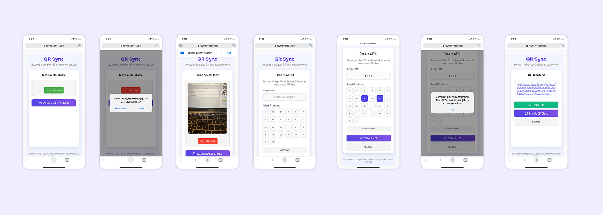
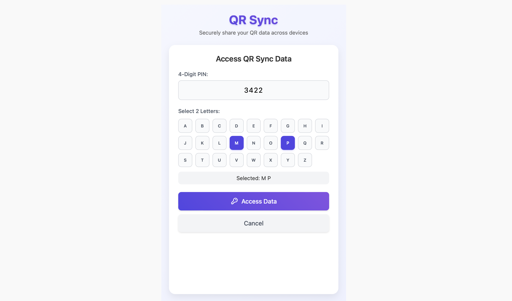
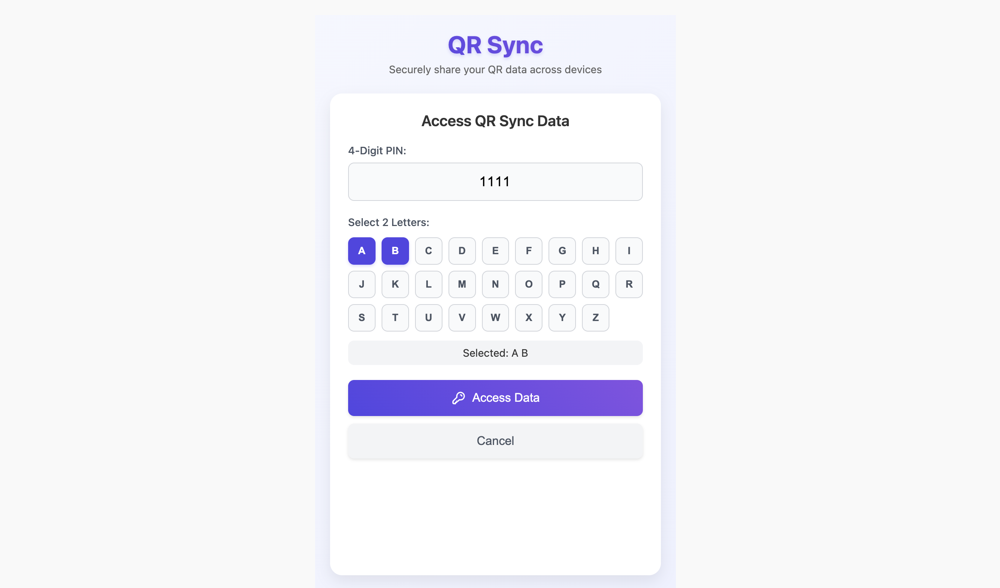
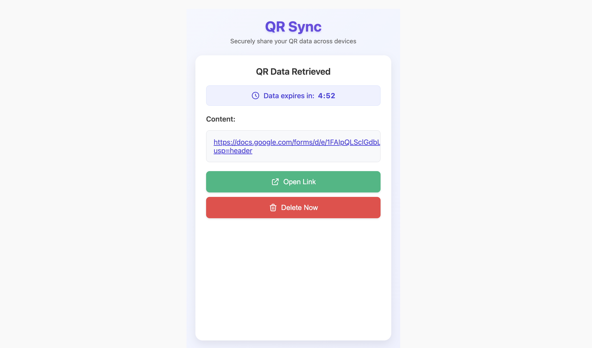

# QR Sync 🔄

<div align="center">

[](https://opensource.org/licenses/MIT)


**Securely share QR data across devices with timeboxed encryption**

</div>

## ✨ Overview 

QR Sync lets you scan a QR code on one device and access its content securely on any other device, anywhere, anytime. Your data stays encrypted in the cloud for just 5 minutes before being permanently deleted - balancing convenience with security.

> Just a boring day and a good project. :)

## 🚀 Features

- **Cross-Platform Compatibility**: Works on any device with a web browser
- **End-to-End Encryption**: PIN + Character authentication for secure access
- **Auto-Deletion**: Data automatically removed after 5 minutes
- **Mobile Optimized**: Clean, responsive interface on all screen sizes
- **Easy Sharing**: Simple workflow for accessing data across devices

## 📱 How It Works

### Step 1: Scan a QR Code
Open the app on your mobile device, click "Start Scanning", and grant camera permissions. Scan any QR code to capture its data.



### Step 2: Enable QR Sync
After scanning, tap "Enable QR Sync" to prepare your data for cross-device access.

### Step 3: Create Security Credentials
Set a 4-digit PIN and select two letters to create your secure access key. This combination is used for encryption and hashing.



### Step 4: Access on Any Device
Open QR Sync on any other device (web, mobile, tablet) and click "Access QR Sync Data".

### Step 5: Enter Your Credentials
Enter the same 4-digit PIN and two characters you selected earlier, then click "Access Data".



### Step 6: View Your Data
Your data will be displayed securely. A countdown timer shows when the data will be automatically deleted.



## ⏱️ Security Note

For your privacy and security:
- Data remains encrypted in the database
- All information is automatically deleted after 5 minutes
- Your encryption keys are never stored in plain text

## 💻 Technical Implementation

QR Sync uses:
- React with Next.js for the frontend
- Supabase for backend storage and authentication
- SHA-256 hashing for PIN security
- Responsive design for all devices

## 🔧 Installation

```bash
# Clone the repository
git clone https://github.com/yourusername/qr-sync.git

# Navigate to project directory
cd qr-sync

# Install dependencies
npm install

# Start development server
npm run dev
```

## 🤝 Contributing

Contributions are welcome! Feel free to fork this repository and submit pull requests to help improve QR Sync.

## 📄 License

This project is licensed under the MIT License - see the LICENSE file for details.

---

<div align="center">

## Enjoy this project! 
### Fork and use for your personal projects.
### Happy Coding! 😊

</div>